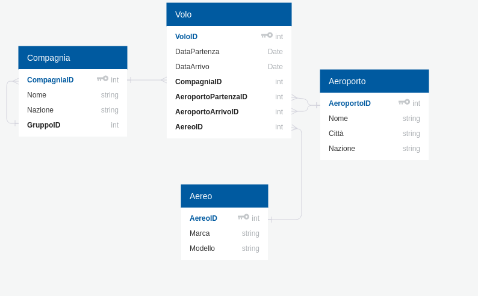

# Assignment 3

## Componenti

Ventura Samuele: 793060

Repository gitlab: https://gitlab.com/s.ventura/assignment3.git

## Progetto

Per il progetto si è scelto di modellare il dominio rappresentante i voli, secondo il seguente schema:

Si è sfruttato Hibernate per la persistenza delle entità e per cofigurare la connessione al database MySQL.

Le entità implementate sono:

* Compagnia che rappresenta una compagnia aerea che offre dei voli
* Aereo che rappresenta i modelli di aerei che eseguono precisi voli
* Aeroporto per rappresentare l'aeroporto di partenza e arrivo
* Volo che rappresenta il volo offerto da una compagnia, eseguito da un certo aereo, con determinati aeroporti e in certe date

Si sono definite le seguenti relazioni:

* Una self-relation in Compagnia che indica la possibilità di un gruppo di compagnie con a capo una di queste
* Una relazione one-to-many tra Compagnia e Volo perché una compagnia offre più voli mentre un volo è offerto da una sola compagnia
* Una relazione one-to-many tra Aereo e Volo perché si è immaginato che un volo fosse eseguito dal solito aereo
* Due relazioni one-to-many tra Aeroporto e Volo per rappresentare l'aeroporto di partenza e arrivo

## Setting progetto

Per sviluppare il progetto si è sfruttato Maven e quindi possibile importare il progetto da gitlab come progetto maven esistente e automaticamente verrano scaricate le librerie necessarie, se si necessità di altre librerie o dipendenze è possibile modifacare il file `pom.xml`

Per la persistenza su DB si è sfruttato MySQL 5.7 quindi è necessario averlo installato e creare un utente con nome = prova e password = prova. Oppure è possibile modificare utente e password con cui connettersi nel file persistence.xml.

Il database viene creato se non è già esistente.

Per il progetto sono stati implementati solo dei casi di test senza una GUI interattiva.

## Struttura package

I package del progetto e le varie classi sono strutturati come segue:

* nella cartella src/main/java  ci sono i seguenti package:
  * `com.samuele.orm.entities` in cui sono presenti le classi che definiscono le entità modellate.
  * `com.samuele.orm.repositories ` in cui si sono implementati i metodi base per le operazioni CRUD.
  * `com.samuele.ormservices` in cui si sono implementati i servizi che richiamano le operazioni CRUD all'interno di una transazione.
  * `com.samuele.orm.dbManager` in cui si è definito un metodo sfruttato nell'esecuzione dei test per ripulire il database.
* nella cartella src/test/java ci sono i seguenti package:
  * `com.samuele.orm.services` nel quale vengono testate le operazioni base di CRUD sulle varie entità. E' stata creata una classe per ogni entità ed eseguendo la classe `TestAllEntities` è possibile eseguire tutte le classi di test del package insieme.
  * `com.samuele.relations` in cui si testano invece le varie relazioni tra le entità create. Eseguendo `TestAllRelations` è possibile eseguire tutte le classi di test del package insieme.